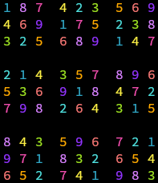

# 🧩 Sudoku Generator

## 🎯 Project Goal

This project is a **Sudoku board generator** written in C. Its goal is to generate a complete, valid 9x9 Sudoku grid using the **backtracking algorithm**. Each time the program runs, it produces a fully randomized, correct Sudoku board.

## 🧠 Approach – Backtracking Algorithm

The board is filled using a recursive **backtracking** approach:

1. Iterate over the cells of the board.
2. For each empty cell, check which values (1–9) are valid, according to Sudoku rules.
3. Try each valid number, and recursively attempt to fill the rest of the board.
4. If no valid number can be placed, **backtrack** to the previous cell and try a different option.

### 🔧 Example: `fillSudoku` function

```c
bool fillSudoku(int **matrix, int row, int col) {
  // End of sudoku
  if (row == 9) {
    return true;
  }
  // End of row, go to next one
  if (col == 9) {
    return fillSudoku(matrix, row + 1, 0);
  }
  // Skip if cell is already filled
  if (matrix[row][col] != 0) {
    return fillSudoku(matrix, row, col + 1);
  }

  // Generate possible values
  bool *parr = possibleValues(matrix, row, col);
  // Recursively try all possible values
  for (int i = 0; i < MAX_VALUE; i++) {
    if (parr[i]) {
      matrix[row][col] = i + 1;
      if (fillSudoku(matrix, row, col + 1)) {
        return true;
      }
      matrix[row][col] = 0;
    }
  }
  free(parr);

  return false;
}
```

🔍 The generated board is always **correct and complete**, although not necessarily unique — which is typical for this type of generator.

---

## 🖼️ Preview (Terminal Screenshot)

<p align='center'>
  
</p>

---

## 📚 Reference

This project was inspired by and based on materials from:  
🔗 [GeeksForGeeks – Sudoku Generator](https://www.geeksforgeeks.org/dsa/program-sudoku-generator/)

---

## 🛠️ Technologies Used

- Language: `C`
- Terminal Styling: `ANSI Escape Codes`
- Algorithm: `Recursive Backtracking`

---

## 📥 How to Run

```bash
gcc main.c -o main
./main
```

---

## 🚧 TODO (Optional Improvements)

- Add difficulty levels by removing cells
- Ensure uniqueness of generated puzzles
- Save or export generated boards
- Add a simple terminal-based UI